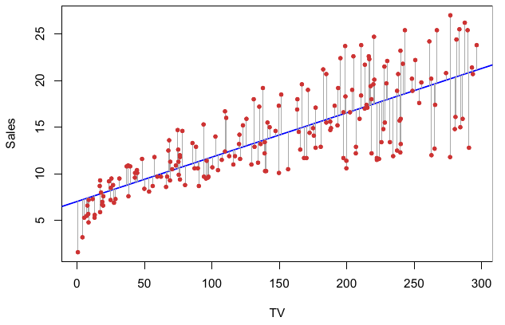
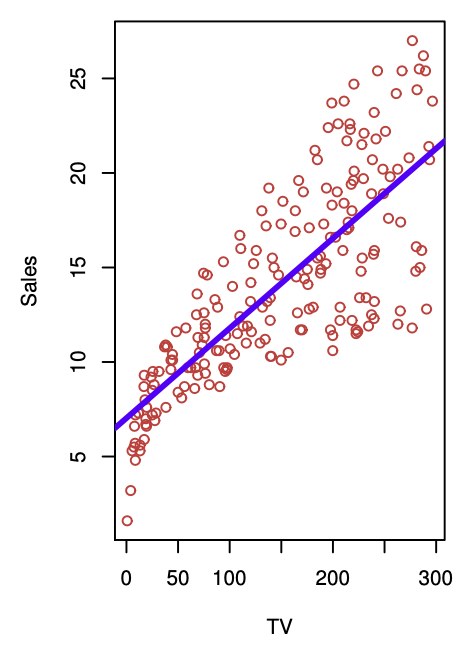
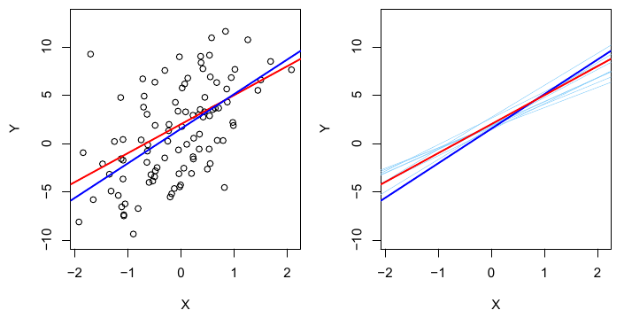
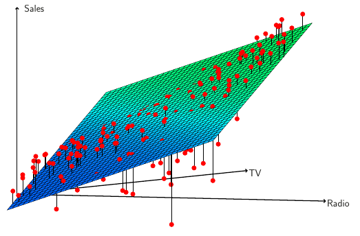

## Linear Regression {.cover data-background-color="#132b3a"}

::: {.subtitle}
Simple and multiple linear regression
:::

::: {.author}
Presented by:  
Jingwen Zhong, Siyi Zhu, Jingxuan Feng, Coco Liu
:::

## The advertising example 

How are **sales** related to spending on **TV, radio, and newspaper advertising**?

::: {.small-bullets}
- Data: advertising budgets and sales in **200 markets**.
- Response: sales, measured in **thousands of units**.
- Predictors: advertising budgets, measured in **thousands of dollars**.
:::

{fig-alt="The advertising dataset, sales in thousands of units, as a function of TV, radio, and newspaper budgets, in thousands of dollars, for 200 different markets. In each plot we show the simple least squares fit of sales to that variable" .plot}

::: {.takeaway}
We want to understand the relationship and predict sales for a given advertising budget.
:::

## Simple linear regression 

$$Y=\beta_0+\beta_1X+\epsilon$$

| Term | Meaning |
|:---|:---|
| $\beta_0$ | Intercept: expected response when $X=0$ |
| $\beta_1$ | Slope: average change in $Y$ for a one-unit increase in $X$ |
| $\epsilon$ | Error: variation not captured by the linear relationship |

The true coefficients $\beta_0$ and $\beta_1$ are **unknown**, so we estimate them from the observed data.

$$\beta_0,\beta_1
\quad \longrightarrow \quad
\hat{\beta}_0,\hat{\beta}_1$$

::: {.takeaway}
A **hat** means “estimated from the sample”:  $\hat{\beta}_0$ and $\hat{\beta}_1$ are estimates of the unknown population coefficients.
:::

Using these estimates, we predict the response at $X=x$ with

$$\hat{y}=\hat{\beta}_0+\hat{\beta}_1x$$

## Fitting the line: least squares 

:::: {.columns}
::: {.column width="48%"}
{fig-alt="TV advertising and sales with the least squares line and vertical residuals." .plot}
:::
::: {.column width="48%"}
A **residual** is the difference between the observed and predicted response:
$$e_i=y_i-\hat y_i$$

Choose $\hat\beta_0$ and $\hat\beta_1$ to minimize the **residual sum of squares**:

$$
\mathrm{RSS}
=
\sum_{i=1}^{n}(y_i-\hat y_i)^2
=
\sum_{i=1}^{n}(y_i-\hat\beta_0-\hat\beta_1x_i)^2
$$
:::
::::

::: {.takeaway}
**Least squares fit:** choose $\hat\beta_0$ and $\hat\beta_1$ so the fitted line is as close as possible to the observed points, measured by squared vertical residuals.
:::

## Interpreting the TV model 

:::: {.columns}
::: {.column width="42%"}
{
  fig-alt="Fitted line with TV budget as predictor and sales unit as response."
  .plot
}
:::

::: {.column width="54%"}

$$
\widehat{\mathrm{sales}}
=
7.0325+0.0475\times\mathrm{TV}
$$

- An additional **$1,000 in TV spending** is associated with an average increase of about **47.5 sales units**.
- At **$100,000 in TV spending**, predicted sales are about **11,783 units**.
:::
::::

::: {.takeaway}
Interpret the coefficient using the units of both the predictor and the response.
:::

## How accurate are the coefficient estimates? 

:::: {.columns}
::: {.column width="52%"}
{fig-alt="The population regression line and least squares lines fitted to different samples." .plot}
:::

::: {.column width="44%"}

The **true regression line is fixed**, but different samples give different fitted lines.

So the estimated slope $\hat\beta_1$ varies from sample to sample.

A **standard error** measures this sampling variability.

**Smaller SE = more precise estimate.**

The slope is generally estimated more precisely with:

- **Less noise** around the line.
- **More observations** with a similar spread of $X$.
- **More spread in $X$**, with other factors unchanged.

:::
::::

## Confidence intervals for coefficients 

An approximate **95% confidence interval** for the slope is:

$$
\hat\beta_1\pm2\,\operatorname{SE}(\hat\beta_1)
$$

For the TV regression:

$$
0.042\leq\beta_1\leq0.053
$$

This corresponds to about **42–53 additional sales units per $1,000** of TV spending.

::: {.takeaway}
The interval describes uncertainty about the slope, not the sales of one market.
:::

## Is there a relationship?

Test whether the true slope is zero:

$$
H_0:\beta_1=0
\qquad \text{versus} \qquad
H_a:\beta_1\ne0
$$

Compare the estimated slope with its standard error:

$$
t=\frac{\hat\beta_1}{\operatorname{SE}(\hat\beta_1)}
$$

For TV: **$t=17.67$**, **$p<0.0001$**.

A very small p-value means that an estimated slope this far from zero would be
very unlikely if $H_0$ were true.

::: {.takeaway}
We reject $H_0$. The data provide strong evidence of a relationship
between TV advertising and sales.
:::

## How well does the model fit? 

$$
\mathrm{RSE}=\sqrt{\frac{\mathrm{RSS}}{n-2}},
\qquad
R^2=1-\frac{\mathrm{RSS}}{\mathrm{TSS}}
$$

where

$$
\mathrm{TSS}=\sum_{i=1}^{n}(y_i-\bar y)^2,
\qquad
\mathrm{RSS}=\sum_{i=1}^{n}(y_i-\hat y_i)^2.
$$

**TSS:** total variation in sales.  
**RSS:** variation left unexplained by the model.

- **RSE = 3.26:** about **3,260 sales units**.
- $\mathbf{R}^{\mathbf{2}}$ **= 0.612:** the model explains **61.2%** of the variation in sales.

::: {.takeaway}
**Takeaway:** RSE is in response units; $R^2$ is a proportion.
:::

## Multiple linear regression 

$$Y=\beta_0+\beta_1X_1+\cdots+\beta_pX_p+\epsilon$$

Estimate the coefficients together using **least squares**.

| Intercept | TV | Radio | Newspaper |
|---:|---:|---:|---:|
| 2.939 | 0.046 | **0.189** | −0.001 |

### What does “holding others fixed” mean?

Compare two markets with the **same TV and newspaper budgets**, but one spends **$1,000 more on radio**.

<!-- change the wording -->

::: {.takeaway}
The model predicts **189 more sales units on average** for that market.
:::

::: {.source}
This is an association; it does not by itself establish cause and effect.
:::

## Why does the newspaper coefficient change? 

| Newspaper | Newspaper alone | With TV and radio |
|:---|---:|---:|
| Coefficient | 0.055 | −0.001 |
| p-value | 0.00115 | 0.8599 |

<!-- add question interaction -->

Newspaper and radio budgets are correlated: **0.3541**.

::: {.takeaway}
Once TV and radio are included, there is little evidence that newspaper spending is associated with sales.
:::

## Testing the multiple regression model 

Is **at least one predictor** related to the response?
$$H_0:\beta_1=\cdots=\beta_p=0$$
$$F=\frac{(\mathrm{TSS}-\mathrm{RSS})/p}{\mathrm{RSS}/(n-p-1)}$$

For the three advertising predictors: **F ≈ 570**, with a very small p-value.

- The **F-test** checks whether at least one slope differs from zero.
- Individual **t-tests** assess each predictor while the others are included.

<!-- add table 3.4 -->

## Choosing useful predictors 

With $p$ predictors, there are **$2^p$ possible subsets**.

| Method | Basic idea |
|:---|:---|
| Forward selection | Start with no predictors; add useful predictors |
| Backward selection | Start with all predictors; remove the least useful |
| Mixed selection | Allow both additions and removals |

::: {.takeaway}
A larger model can fit the available data better without predicting new observations better.
:::

## Comparing the advertising models 

| Predictors | R² | RSE |
|:---|---:|---:|
| TV | 0.612 | 3.26 |
| TV + radio | 0.89719 | 1.681 |
| TV + radio + newspaper | 0.89720 | 1.686 |

Adding radio gives a substantial improvement.

Adding newspaper changes R² very little and slightly increases RSE.

::: {.source}
For multiple regression, RSE = $\sqrt{\frac{\mathrm{RSS}}{(n-p-1)}}$. RSE is in thousands of sales units.
:::

## How accurate are the predictions? 

Three sources of uncertainty:

- **Coefficient estimation:** the fitted coefficients depend on the sample.
- **Model bias:** a linear model may only approximate the true relationship.
- **Irreducible error:** individual responses vary even at the same budgets.

At TV = **$100,000** and radio = **$20,000**, predicted sales ≈ **11,256 units**.

| What are we predicting? | 95% interval, sales units |
|:---|---:|
| Average sales: confidence interval | 10,985–11,528 |
| One city’s sales: prediction interval | 7,930–14,580 |

::: {.source}
The prediction interval also includes individual error, so it is wider. Neither interval automatically accounts for model bias.
:::

## Interaction: TV and radio working together

:::: {.columns}
::: {.column width="54%"}
{fig-alt="Actual sales above and below the fitted TV-radio regression plane." .plot}
:::
::: {.column width="42%"}
An **interaction** means the relationship between one predictor and sales depends on the other predictor.

When TV and radio budgets are similar, actual sales tend to be **higher than the model predicts**.

This suggests that TV and radio may work especially well **together**, beyond their separate contributions.
:::
::::

## Extension: can linear regression fit a curve? {#polynomial-regression}

Adding a squared predictor makes the model more flexible:
$$Y=\beta_0+\beta_1X+\beta_2X^2+\epsilon$$

- Treat **$X$ and $X^2$ as two predictors**; fit them using least squares.
- Still **linear in the coefficients**, even though the fitted relationship can curve.
- Example: increases in average sales could become smaller as TV spending grows.

::: {.takeaway}
**Discussion:** Would adding more powers of $X$ always improve predictions for new data?
:::

## Main points {.closing data-background-color="#132b3a"}

**Simple regression:** Uses one predictor to describe the response.

**Multiple regression:** Uses several predictors; interpret each slope while holding the others fixed.

**Fit:** Least squares minimizes the sum of squared residuals.

**Assess:** Standard errors, confidence intervals, and tests describe uncertainty; RSE and R² describe fit.

**Predict:** A confidence interval concerns the average response; a prediction interval concerns an individual response.

**Interaction:** The relationship between one predictor and the response can depend on another predictor.

::: {.source}
Reference: *An Introduction to Statistical Learning* — Gareth James et al.
:::

## 10-minute lab: your turn

Open `exercise.qmd`.

Your tasks:

1. Fit `sales ~ TV`.
2. Interpret the TV slope and $R^2$.
3. Fit `sales ~ TV + radio + newspaper`.
4. Compare the newspaper coefficient and p-value across simple and multiple regression.
5. Produce a confidence interval and a prediction interval for a new market.

::: {.takeaway}
**Main question:** Why does newspaper look useful alone but not after accounting for TV and radio?
:::
