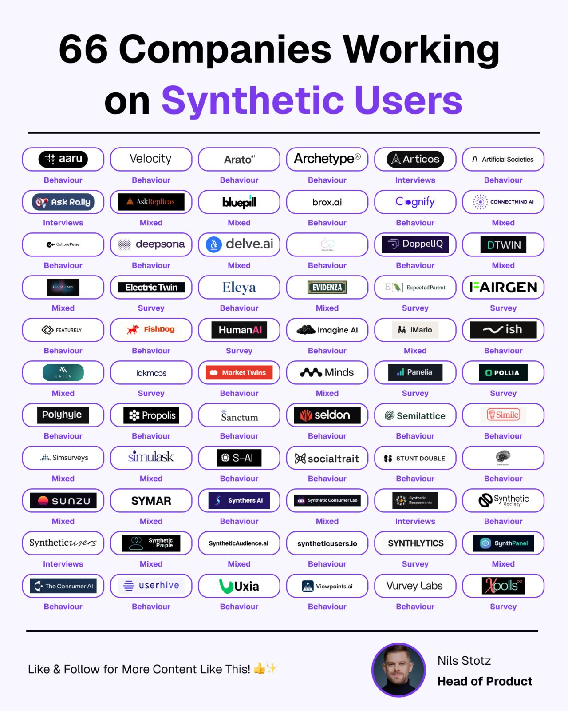

# This week

## Plan

- ISLR/P group 2: Chapters 3.1 and 3.2, linear regression
- Demonstration: OpenRouter, open-weight models, structured outputs, caching and cost, OpenCode
- Lecture: what a silicon sample is, and the two ways it fails
- Demonstration: twelve personas, one question, three models, with caching and a budget
- Worksheet: silicon samples across three models and two prompts
- Guest: Oscar Heath

::: {.notes}
:::

# Part I: The problem

## Surveys are getting harder

- Response rates to household surveys have been decreasing for thirty years.
- The US Current Population Survey had a response rate of 64 per cent in November 2025, lower than at any point in the pandemic [@Rodgers2025].
- Fewer responses means more cost per response, and more weighting to fix who answered.

::: {.notes}

:::

## What a poll gives you

- The marginal is the share of people who say they will vote for each option.
- The variation is that people who look alike still give different answers, and groups differ from each other.
- The marginal is the headline. The variation is where the uncertainty on a forecast comes from.

::: {.notes}

:::

## The marginal and the variation

### (Made-up numbers!)

Ask a hundred people who they will vote for.

| | Chow | Bradford | Would not vote |
|---|---:|---:|---:|
| All 100 | 45 | 40 | 15 |
| 30 renters under forty | 18 | 9 | 3 |
| 20 homeowners over sixty | 7 | 12 | 1 |

::: {.notes}

:::

## Same marginal, no variation
### (Made-up numbers!)

| | Chow | Bradford | Would not vote |
|---|---:|---:|---:|
| All 100 | 45 | 40 | 15 |
| 30 renters under forty | 30 | 0 | 0 |
| 20 homeowners over sixty | 0 | 20 | 0 |

::: {.notes}
- Now a silicon sample of a hundred personas. The first row is the same, so if you only looked at the headline you would say it matched the poll.
- But every renter under forty says Chow and every homeowner over sixty says Bradford. The model has turned each group into one person.
- This sample is useless for two things. Anything about subgroups, because every subgroup is unanimous. And any statement of uncertainty, because the person-to-person spread you would build an interval from is gone.
- That is the finding of @Bisbee2024 in one table. The means sit close to real means and the distributions are far too narrow. It is also why the worksheet asks one persona twenty times before it asks thirty personas once. If one persona gives the same answer twenty times, the model is not sampling people, it is looking up the group's modal answer.
:::

## The idea

> We create "silicon samples" by conditioning the model on thousands of socio-demographic backstories from real human participants in multiple large surveys conducted in the United States.
>
> @Argyle2023 [p. 1]

::: {.notes}
- @Argyle2023 is the paper that named the idea. The claim is that a language model's bias is not one uniform thing. It is fine-grained and correlated with demographics, so if you condition the model on a description of a person, you get back something that looks like what that kind of person would say. They call that property algorithmic fidelity.
- The word "backstory" is doing a lot of work. It means a description of a person, such as their age, race, state, and education. We will call it a persona.
- Notice that their backstories come from real survey respondents. That is the design we follow.
:::

## Why anyone would want this

- It takes minutes.
- It costs cents.
- You can ask about an election nobody polled.
- (But, but, but...)

::: {.notes}
- Silicon samples are now used in economics, psychology, marketing, and to predict the results of experiments. For instance, there are companies that sell synthetic customers for market research.
- It is cheap enough to do without thinking about it.
:::

## And people are selling it

{fig-align="center" height="500"}

::: {style="font-size: 0.5em; text-align: center;"}
Nils Stotz, via LinkedIn, 2026.
:::

::: {.notes}
- Sixty-six companies, sorted by whether they sell synthetic survey respondents, synthetic interviewees, or synthetic behavior. Most of them are selling the thing this lecture is about to pull apart.
:::

## Some ways it can go wrong.

- A wrong marginal, where the model's share for an option is not the population's share.
- A collapsed spread, "mode collapse", where the model gives nearly the same answer for everyone who looks alike, so the variation is too small. 

::: {.notes}

:::

# Part II: The LLM solution

## One call

- The system message is a persona. "You are a 34-year-old woman who rents in Ward 13 and works in retail."
- The user message is a question. "If the election were held today, who would you vote for?"
- The answer is structured, one of a fixed set of options plus a confidence.

::: {.notes}
- The structured answer matters because you need something that goes in a data frame. A paragraph is not a response that we can directly use (we could parse it but it's kind of a pain).
:::

## Many calls

- Draw personas from a survey, a census, or marginals.
- Ask every persona the same question.
- Tabulate, and compare the marginal and the spread with something real.

::: {.notes}

:::

## The design in @MurrayAlexander2026

- 100 personas from the 2025 Cooperative Election Study, drawn in proportion to the survey weights.
- Each respondent's 2024 presidential vote and 2026 House intention held out.
- Four things are changed. The model, the persona detail, the news the model is given, and the prompt style.
- Every one of the 816 combinations is run for every persona, which is 81,600 responses.

::: {.notes}
- The CES is a 17,000-person survey fielded by YouGov in November 2025 [@Schaffner2026]. Its weights are designed to make it look like the US adult population, so drawing a hundred personas in proportion to those weights gives you a hundred roughly representative people.
- The point of the factorial design is that you can hold everything fixed but one thing and see what that one thing does. That is what lets us say which choice matters most, which is exactly the worksheet question at a much smaller scale.
- The held-out vote is what makes this an evaluation rather than a demonstration.
:::

## What one prompt looks like

1. The day's news summary, if any.
2. The persona, at one of three levels of detail.
3. The question, in one of four styles.

> If an election was held today, how would you vote? Answer with exactly one of the following: Democrat, Republican, Third party, Would not vote.

::: {.notes}
- The news comes first because it is the part that changes least across calls, so it can be cached by the provider, which halves the input cost.
- "Answer with exactly one of the following" is the structured-output idea done in prose.
:::

# Part III: Decisions

## Four decisions

- Which model?
- How much to tell it about the person?
- What to tell it about the world?
- How to ask?

::: {.notes}
:::

## Decision 1, the model

| Model | Input / output, USD per million tokens | Average output tokens |
|---|---|---:|
| Claude Sonnet 5 | 2.00 / 10.00 | 56 |
| Claude Haiku 4.5 | 1.00 / 5.00 | 141 |
| GPT-5.4 | 2.50 / 15.00 | 11 |
| DeepSeek V4 Flash | 0.14 / 0.28 | 1,794 |

::: {.notes}
- Prices as at 21 August 2026, when the queries were run. Two Anthropic models to see whether a cheaper model from the same provider behaves the same. GPT-5.4 as the other frontier provider. DeepSeek as a Chinese open-weight model, and the only one of these four that you can download.
- The output token column is the surprise. GPT-5.4 answers with one word. Haiku answers in prose. DeepSeek V4 Flash reasons before it answers and uses 1,794 tokens to say "Democrat". So the cheapest model per token is not the cheapest per answer.
- Tokenizers differ too. The same prompt was 2,184 tokens for Sonnet and 1,254 for GPT-5.4.
- In the demonstration we use open-weight models only.
:::

## Decision 2, the persona

- Three characteristics, which are race, gender, and state.
- Nine, adding education, religion, marital status, sexual orientation, voter registration, and household income.
- Eleven, adding party identification and ideology.

::: {.notes}

:::

## Decision 3, the news

- Newspapers, which are the New York Times, Washington Post, Wall Street Journal, and USA Today.
- Right-leaning sites, which are Fox News, the New York Post, and the Daily Wire.
- Left-leaning sites, which are HuffPost, Mother Jones, and Vox.
- Wikipedia's current events page.
- Nothing.
- Four days in July 2026, summarized by a model, pages from the Internet Archive.

::: {.notes}
- A model trained up to some date knows nothing after it. If you want it to answer as a person living in October 2026, you have to tell it what has been happening. One option is to give it internet access, but then you cannot reproduce the run. The other is to put a summary of the news in the prompt, which is what the paper does.
- "Summarized by a model" is a decision inside a decision. The summaries were written by Claude Opus 5. It is not one of the evaluated models, and it is from the same company as two of them.
- The no-news setting is the baseline. Without it you can only compare diets with each other, not with an uninformed answer.
:::

## Decision 4, the prompt style

- Role-play. "You are [description]."
- Individual prediction. "Consider [description]. How do you think such a person would respond?"
- Population framing. "Consider the distribution of likely responses for [description]."
- Verbalized distribution, which is the population framing but asking for a share for each option rather than one answer.

::: {.notes}
- Three of these produce one answer per call. The fourth produces four numbers that sum to a hundred. It is motivated by @Zhang2025, who found that asking for a distribution reduces mode collapse in some settings.
- Role-play is what the demonstration does, because it is the simplest and the most common in the literature. You will see in a moment that it is also the most sensitive to the news and the most likely to refuse.
:::

## And want to do with unclear responses?

- Answers that do not match an option have to be classified.
- Done by GPT-5.4 Mini.
- 93 per cent of Haiku's single answers needed it; under 1 per cent of GPT-5.4's and DeepSeek's.

::: {.notes}
- This is why the demonstration uses a JSON schema with `strict`. You want the model's answer to be one of your options, or a recorded failure, not prose that a second model then has to read.
- Whenever a model is used to classify another model's output, that is another model in the pipeline, with its own choices.
:::

# Part IV: Results

## Compared with 2024 results

- Every model that answers overstates Democrat support, at 42 to 48 per cent against 33 per cent self-reported 2024 vote.
- Every model understates not voting, at 12 to 13 per cent against 26 per cent.
- The best configuration matches 78 per cent of individuals; the median configuration matches 58 per cent.

::: {.notes}
- This is the marginal failure. The direction is consistent across models, which suggests it is not a quirk of one of them.
- The non-voting result matters for Assignment II. Real polls screen for likely voters. A silicon sample does not unless you make it, and the models seem to think everyone votes.
- The individual-level number is what you need if you want to use a persona as a stand-in for a particular kind of person, say for a subgroup estimate. Fifty-eight per cent is not far above guessing the most common category.
:::

## Which decision matters most

- The model changes the Democrat share from 23 per cent (Haiku 4.5) to 48 per cent (DeepSeek V4 Flash), averaged over everything else.
- The news changes it from 34 per cent with a right-leaning diet to 44 with a left-leaning one, a gap of 10 points.
- The persona changes it from 36 per cent with three characteristics to 43 with eleven.
- The prompt style mostly changes how often the model refuses.

::: {.notes}
- These are averages over every other choice, from Figure 4 of the paper. The model explains 41 per cent of the variation in the Democrat share between configurations and the news diet 6 per cent. But the news diet is the biggest single influence on the margin between the parties, because it moves both parties in opposite directions.
- Haiku's 23 per cent is mostly refusals, since it would not answer 53 per cent of the time. Leave it aside and the models sit between 42 and 48.
- GPT-5.4 is the only model that gives more Republican than Democrat answers on average, 45 to 43.
:::

## The decisions interact

- The gap between left- and right-leaning news is 17 points for GPT-5.4 and 3 for DeepSeek V4 Flash.
- The same gap is 17 points with a three-characteristic persona and 2 once party identification is in the persona.
- Haiku refuses 83 per cent of 3-characteristic personas, 19 per cent of 11-characteristic ones.

::: {.notes}
- How much the news matters depends on the model and on the persona. Once the persona says the person is a Republican, the news does almost nothing, which is sensible. When the persona is three facts, the news is doing the work of deciding.
- It also means the worksheet question, model or prompt, does not have one answer. It depends on what else is in the prompt.
:::

## The same persona, four models

| | Democrat | Republican | Would not vote | Refused or unclear |
|---|---:|---:|---:|---:|
| Haiku 4.5 | 35 | 27 | 6 | 32 |
| Sonnet 5 | 45 | 32 | 16 | 7 |
| V4 Flash | 49 | 29 | 22 | 0 |
| GPT-5.4 | 51 | 44 | 5 | 0 |

::: {.notes}
- This is Table 1 of the paper, with a nine-characteristic persona, the population framing, and no news. The prompt is identical across the four models. Shares are percentages of the hundred personas.
- Across all 153 prompt settings, the gap between the highest and lowest model is a median of 23 percentage points and as much as 98. The models agree most when the persona has nine or eleven characteristics.
:::

## Change one thing

- Changing one aspect moves the Democrat share by five points or less in 59 per cent of pairs.
- Changing only the day of the news moves it that little in 81 per cent of pairs.
- Going from three to nine characteristics moves it by as much as 43 points.
- Adding party identification raises the Democrat share in 50 per cent of pairs and lowers it in 42 per cent.

::: {.notes}

:::

## The whole range

- Across 612 single-answer configurations the Democrat share runs from 0 to 100 per cent.
- Within GPT-5.4 alone, 8 to 100.
- Only 10 of 612 are within five points of the 2024 benchmark on both parties.
- Asked for a distribution instead of one answer, the range is 37 to 51, with a standard deviation of 2.6 points instead of 14.9.

::: {.notes}

:::

# Part V: Concerns

## Refusals are data

- Haiku 4.5 refused or answered unclearly 53 per cent of the time.
- Role-play refuses 20 per cent of the time; individual prediction 10 per cent.
- If you drop refusals, your sample is no longer the sample you drew. 

::: {.notes}
:::

## One run is not enough

- The paper ran each configuration once.
- Models are not deterministic, even at temperature zero.

::: {.notes}

:::

## The "answer" is not quite what we asked

- The answer key is self-reported 2024 presidential vote and stated 2026 House intention.
- The question is "if an election was held today, how would you vote?"
- Self-reported turnout is too high. House and presidential are not the same race.
- Just do your best and report it honestly.

::: {.notes}

:::

## Flattening

- Models represent the typical member of a group better than the atypical one.
- Richer personas do not seem to reliably improve accuracy [@Gordon2026].
- A subgroup estimate from a silicon sample is only as good as individual-level agreement, which was 58 per cent at the median.

::: {.notes}
- This is the collapsed-spread failure in a different guise. If every persona of a type gives the modal answer for that type, the sample has the right marginal for the group and no variation within it. Subgroup analysis then tells you what the model thinks the group is like, not what the group is like.
- @Gordon2026 call it a fidelity paradox, because telling the model more about the person does not necessarily make it more accurate.
:::

## Pew tried this at scale

- @Pew2026 built a digital twin for each of 8,512 people on their American Trends Panel, using demographics, voting history, and 71 earlier survey answers.
- They re-asked three 2026 survey waves, nearly 300 questions, of the twins. Claude Opus 4.6 did best of the models they tried.
- The twins differed from the humans by 12 points on average. On 28 per cent of questions the gap was more than 15 points.

::: {.notes}
- This is the biggest test of the idea so far, by a group whose business is surveys, and with far richer personas than anything in @MurrayAlexander2026. It is worth knowing what went wrong even with the best set-up.
:::

## It makes groups more alike than they are

- 97 per cent of Hispanic twins said they would follow the World Cup. The real share was 43 per cent.
- 95 per cent of Republican twins had a positive view of Israel. The real share was 58 per cent.
- 86 per cent of Democratic twins said billionaires are bad for the country. The real share was 45 per cent.
- Errors were largest for Republicans and for Black adults.

::: {.notes}
- This is the collapsed variation from Part I. Something that is common in a group becomes nearly universal in the twins. The marginal for the group is wrong and the spread within it is gone.
:::

## It is more certain than people are

- Humans chose "not sure" about four times as often as the twins.
- Fewer than six in ten Americans could say what the First Amendment protects. The twins answered correctly about 80 per cent of the time, and on six questions the model put the public at 98 per cent or more.
- 47 per cent of questions had an option that no twin picked at all. For the humans it was 1 per cent.

::: {.notes}
- The model has to produce an answer, and it does not like to say it does not know. The empty options matter for us because the worksheet asks for a share, and a share of zero is a very strong claim.
:::

## It cannot see past its training data

- Trump approval was 37 per cent in January 2026 and 34 per cent in April. The twins said 46 per cent both times. The model's knowledge cutoff was May 2025.
- GPT-5.1 made the public more extreme than it is and Opus 4.6 made it more middle-of-the-road. Humans picked a middle option 45 per cent of the time, GPT 31, Opus 56.
- Pew's conclusion is that this does not replace asking people, and they have no plans to use it.

::: {.notes}
- The same topline twice is the point. A real survey moves because the world moves. The twins only move if the prompt does.
- The model comparison is the same finding as Part IV. Change the model and the answer changes, and here it changes in opposite directions, so there is no safe default.
:::

## What to do about it

- Vary the choices and report the spread, not one number.
- Disclose the exact model identifier, the date queried, the temperature, the full prompt, how the personas were built, how the answers were parsed, and how many configurations were tried.
- Consider asking for a distribution to asking for one answer.

::: {.notes}

:::

## References
